<h1 align="center">Hi 👋, I'm Shazil Hamzah</h1>
<h3 align="center">A passionate Backend Developer & Cloud Enthusiast from Pakistan</h3>

- 🔭 I’m currently working on **Full-stack deployments on Azure Container Apps and Python Automation Tools**

- 🌱 I’m currently learning **Azure Cloud Architecture, Network Engineering, and Advanced Algorithms**

- 📫 How to reach me **shazil.hamzah@outlook.com**

- ⚡ Fun fact **I love chocolates, btw who doesn't? :)**

<h3 align="left">Connect with me:</h3>

<h3 align="left">Languages and Tools:</h3>

<!-- 
&nbsp;
 -->

  
